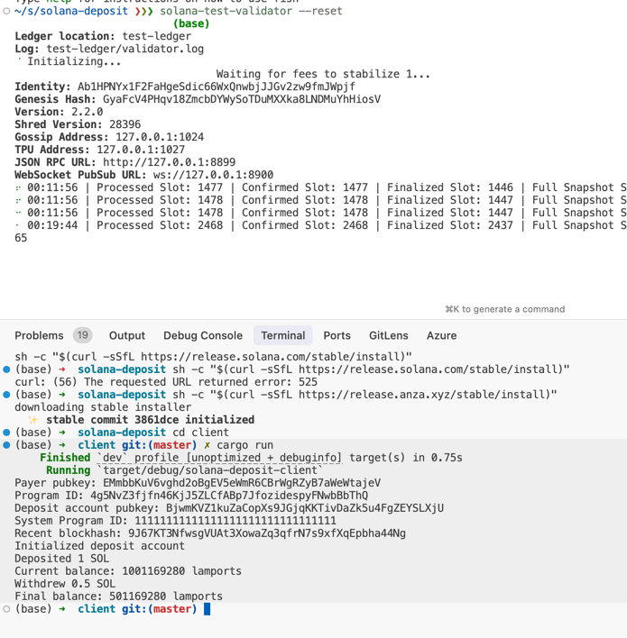

# Solana Deposit Program
 
Smart contract (program) that allows users to deposit SOL, track their balances, and withdraw funds.

## Instructions

1. Build the program
2. Build the client
3. Start validator
4. Deploy the program
5. Start the client

```bash
solana-test-validator --reset
solana config set --url localhost
solana program-v4 deploy target/deploy/solana_deposit_program.so --program-keypair new-program-keypair.json
```

## Building the Program

1. Build the program:
```bash
cd program
cargo build-sbf
```

2. Deploy the program to your chosen network (localnet, devnet, or mainnet):
```bash
solana program deploy target/sbf-solana-solana/release/solana_deposit_program.so
```

Note the program ID after deployment and update it in the client code.

## Running the Client

1. Make sure you have a Solana keypair file at `~/.config/solana/id.json`
2. Update the program ID in `client/src/main.rs` with your deployed program ID
3. Run the client:
```bash
cd client
cargo run
```

